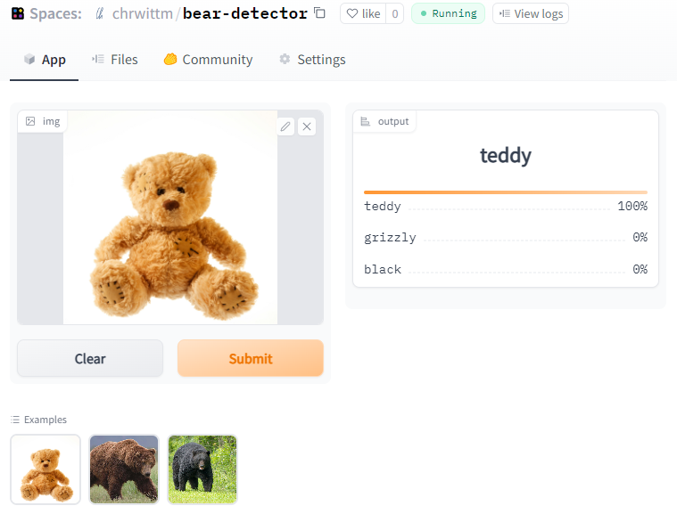
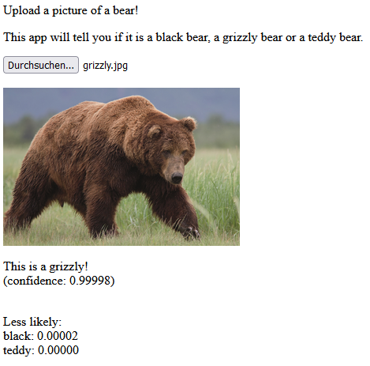
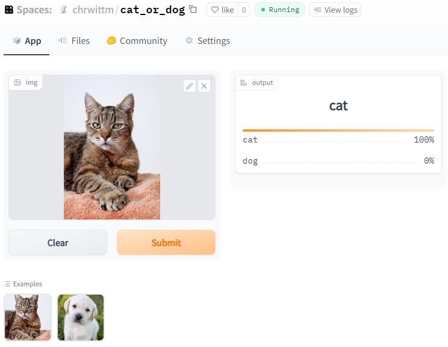
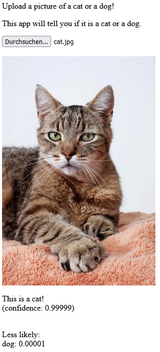

# Lesson 2 of Fast.AI 2022 Edition

Lesson 2 focused on publishing the model (putting things in production).

I approached reworking this lesson in the following way:

* Re-Publishing my [Bear-Detector with HuggingFace](https://huggingface.co/spaces/chrwittm/bear-detector)
* Using the HuggingFace API to create a [GitHub-Pages version of the Bear-Detector](https://chrwittm.github.io/FastAI2022/lesson02/bear_detector/bear_detector.html)
* Picking up the ["Is it a Cat or Dog"-notebook](../lesson01/cat_or_dog/cat_or_dog.ipynb) from lesson 1, I [refined it](/lesson02/cat_or_dog2/cat_or_dog2-training.ipynb) and also put it on [HuggingFace](https://huggingface.co/spaces/chrwittm/cat_or_dog) for a closed-loop repeat.

> Note: This is the [Official Thread in the Forums](https://forums.fast.ai/t/lesson-2-official-topic/96033/1).

## Re-Publishing my Bear-Detector with HuggingFace

After watching the [video](https://www.youtube.com/watch?v=F4tvM4Vb3A0), I worked on my old [bear detector](https://github.com/chrwittm/Bear-Detector) which I created about a year ago (on the previous version of the course / based on the book): Since I have kind of done the training before (i.e. last year), instead of re-visiting that, I first wanted to publish my old model using HuggingFace spaces, because I still remember quite vividly that is was quite difficult to publish last year, failing with Voila, finally doing it Heroku. Additionally, the Heroku free services will also be retired later this year.

### Jumping ahead: The final result

So here it is, the [New Bear Detector](https://huggingface.co/spaces/chrwittm/bear-detector) on HuggingFaces.



All the files are located in the `bear_detector` subfolder, most notably, the [notebook](/lesson02/bear_detector/app.ipynb) which I used to generate the content which I uploaded to HuggingFace.

### How I Re-published the Bear Detector

So I restarted the video at the point where we [publish on HuggingFace](https://www.youtube.com/watch?v=F4tvM4Vb3A0&t=1638s), jumping in the [Gradio + HuggingFace Spaces Tutorial](https://tmabraham.github.io/blog/gradio_hf_spaces_tutorial).

In addition to the video lecture, the following things turned out to be important.

### Learning 1: Installation

The installation of the following packages was necessary on my local machine:

* gradio: `pip install gradio`
* nbdev: `mamba install -c fastchan nbdev`

### Learning 2: Gradio

This piece of code produces warnings:

```python
image = gr.inputs.Image(shape=(192,192))
label = gr.outputs.Label()
```

Instead, the image and the label needs to be instantiated like this:

```python
image = gr.components.Image(shape=(192,192))
label = gr.components.Label()
```

### Learning 3: Exporting the app.py file

The way to export the app.py file does not work anymore the same way it is shown in the video.

This piece of code does not work anymore:

```python
import notebook2script from nbdev.export
notebook2script('app.ipynb')
```

Instead, this is the way to export the code:

```python
from nbdev import nbdev_export
nbdev_export('app.ipynb')
print('Export successful')
```

> Note: Additonally the export only works it the notebook is in a folder called `nbs`.

### Learning 4: Adding requirements.txt

You also need to create a requirements.txt file with the following content:

```python
fastai
scikit-image
```

### Learning 5: Uploading binaries to GitHub

First I cloned my repo:

```bash
git clone https://huggingface.co/spaces/chrwittm/bear-detector
```

The first attempt to upload my `pkl`-file was not successful, because it is a binary:

```
remote: -------------------------------------------------------------------------
remote: Your push was rejected because it contains binary files.
remote: Please use https://git-lfs.github.com/ to store binary files.
remote: See also: https://hf.co/docs/hub/repositories-getting-started#terminal
remote: -------------------------------------------------------------------------
remote: Offending files:
remote:  - export.pkl (ref: refs/heads/main)
```

This kind of upload needs to be done with Git Large File Storage ([LFS](https://git-lfs.github.com/)). To install it in Ubuntu, the following steps are necessary as described [here](https://efrecon.github.io/git-lfs-on-ubuntu/):

```bash
curl -s https://packagecloud.io/install/repositories/github/git-lfs/script.deb.sh | sudo bash
```

```bash
sudo apt-get install git-lfs
```

```bash
git lfs install
```

Afterwards, the files can be added and pushed to git:

```bash
git lfs track "*.pkl"
git add .gitattributes
git add export.pkl
git add app.py
git add blackbear.jpg
git add teddybear.jpg
git add grizzly.jpg
git commit -m "uploaded app"
git push
```

### The final result on HuggingFace

So here it is, the [New Bear Detector](https://huggingface.co/spaces/chrwittm/bear-detector) on HuggingFaces.

Compared to the previous method with Viola / Heroku, the overall workflow was a lot easier.

## Using the HuggingFace API to create a GitHub-Pages version of the Bear-Detector

Restarting the [video at 1:02:13](https://www.youtube.com/watch?v=F4tvM4Vb3A0&t=3733s), it looks pretty straight-forward, but the first topic to "solve" it GitHub Pages:

 [Fastpages](https://fastpages.fast.ai/) is actually depreciated by now, and the new Fast.AI recommendation is [Quarto](https://nbdev.fast.ai/tutorials/blogging.html). To keep things simple, I decided to go with just the GitHub Pages for now. I activated GitHub Pages for my FastAI2022 repo and created a hello-world.html, and [it works](https://chrwittm.github.io/FastAI2022/hello-world.html) :)

Once that was done, I copied the [tiny-pets example](https://github.com/fastai/tinypets/blob/master/1single.html), and made some slight adjustments:

* Swapping out the API: <https://huggingface.co/spaces/chrwittm/bear-detector> - This was actually enough for a running version 1.0 :)
* I also added same functionality as the HuggingSpace app, i.e. I added the display of the probabilities of all categories. That felt like an accomplishment, since I am not really familiar with javascript.

Here is it: [The Bear Detector on GitHub Pages](https://chrwittm.github.io/FastAI2022/lesson02/bear_detector/bear_detector.html)



## Cat or Dog 2.0

The purpose of this exercise was a closed-loop repeat:

* I created a [new notebook](/lesson02/cat_or_dog2/cat_or_dog2-training.ipynb) to train a model which can recognize cats and dogs.
* I created [another notebook](/lesson02/cat_or_dog2/nbs/app.ipynb) as the template for the app
* I uploaded everything to HuggingFace: [Here is the App](https://huggingface.co/spaces/chrwittm/cat_or_dog).
* Created a new HTML-Page for the classification. [Here it is](https://chrwittm.github.io/FastAI2022/lesson02/cat_or_dog2/cat_or_dog.html)

Learnings:

* The nbdev-export still feels shaky
* Uploading to HuggingFace also took longer than anticipated, my dog picture was rejected first as binary. Opening and saving it in Photoshop solved the problem.

Screenshots of the final results:




